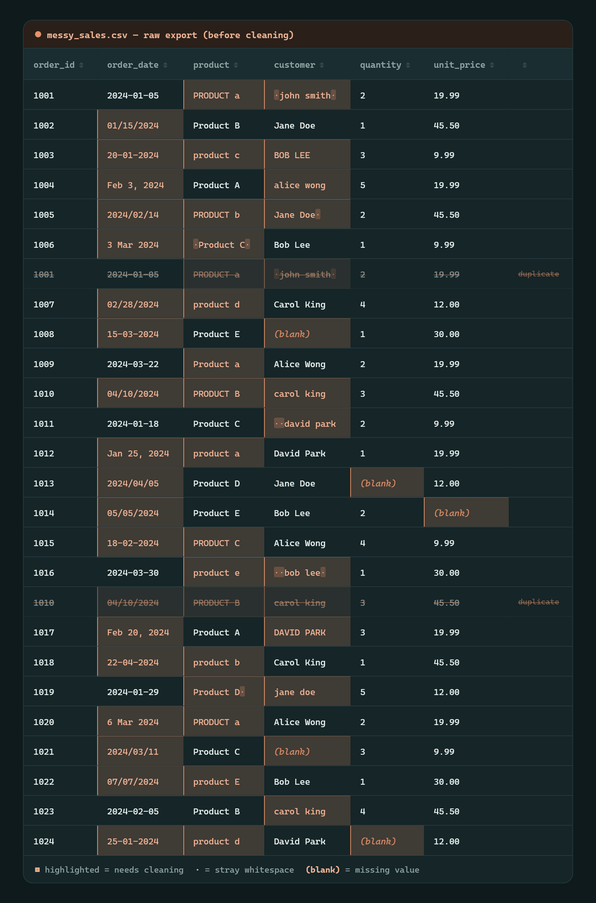
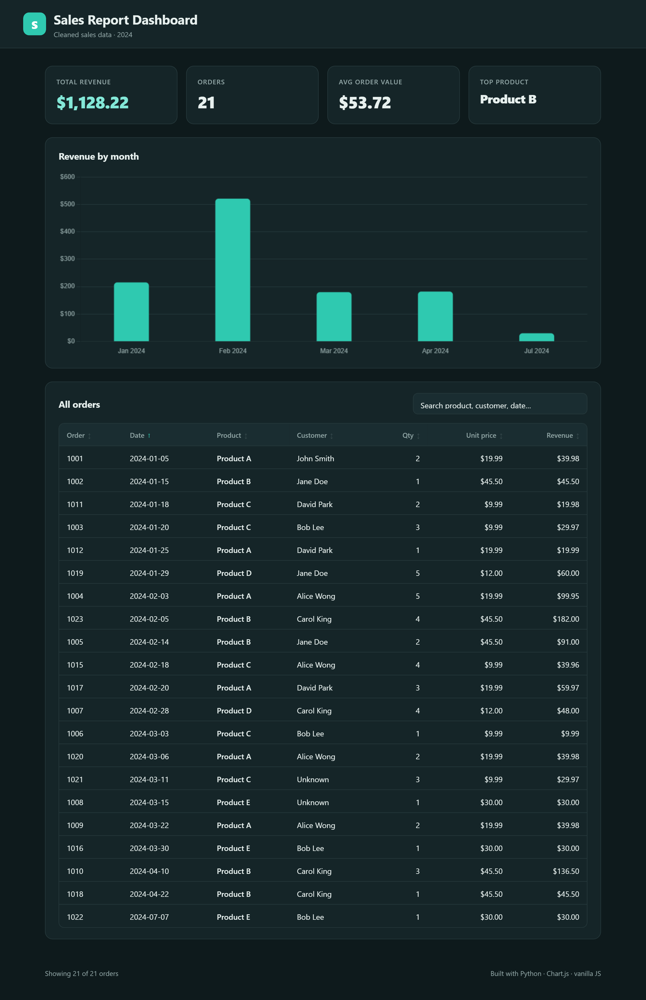
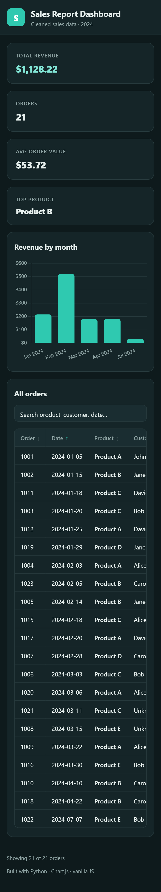

# Sales Report Dashboard


Turns a messy sales CSV into clean data and a responsive dashboard — a Python cleaning script and a front-end report in one project.

**🔗 [Live dashboard](https://muhammadhasnain1-debug.github.io/sales-report-dashboard/)** &nbsp;·&nbsp; **📊 [How it was built (visual walkthrough)](https://muhammadhasnain1-debug.github.io/sales-report-dashboard/walkthrough.html)**

## The problem

Raw sales exports are inconsistent and hard to read. Dates come in every format, the same product is typed five different ways, names have random spacing, rows get duplicated, and cells are left blank. You can't chart data that looks like this — it has to be cleaned first.

This project does both halves: it **cleans** the data with Python, then **presents** it in a dashboard you can actually read.

## Before — the raw export

`messy_sales.csv` is deliberately messy. Every highlighted cell is a problem the cleaner has to fix:



## After — the dashboard

`clean_data.py` produces `clean_sales.csv` and `summary.json`, which the dashboard loads to render stat cards, a revenue chart, and a searchable, sortable table.



### Fully responsive



## How it works

```
messy_sales.csv  →  clean_data.py  →  clean_sales.csv + summary.json  →  index.html (dashboard)
```

**Python side (`clean_data.py`)**
- Removes duplicate rows
- Normalizes 6 mixed date formats into `YYYY-MM-DD`
- Fixes casing and trims whitespace on product/customer names
- Handles missing values (blank customer → `Unknown`; orders missing quantity or price are dropped)
- Writes `clean_sales.csv` and a `summary.json` report

**Front-end side (`index.html` / `style.css` / `script.js`)**
- 4 stat cards: total revenue, orders, average order value, top product
- Chart.js bar chart of revenue by month
- Searchable, sortable table of every cleaned order
- Responsive down to phone width

## How to run

**1. Clean the data** (regenerates the two output files):

```bash
python clean_data.py
```

**2. Serve the dashboard.** Browsers block `fetch()` on `file://`, so run a tiny local server instead of double-clicking the HTML:

```bash
python -m http.server 8000
```

Then open **http://localhost:8000** in your browser.

## Project structure

```
sales-report-dashboard/
├── clean_data.py       # Python cleaner
├── messy_sales.csv     # deliberately messy input
├── clean_sales.csv     # cleaned output
├── summary.json        # summary report the dashboard reads
├── index.html          # dashboard markup
├── style.css           # dashboard styling (responsive)
├── script.js           # loads the data, builds cards / chart / table
├── walkthrough.html    # visual explainer of how the project was built
└── screenshots/
```

## Tech used

- **Python 3** — standard library only, no dependencies
- **HTML / CSS** — responsive layout, light & dark aware
- **Vanilla JavaScript** — data loading, search, sorting
- **Chart.js** — the revenue chart

## License

MIT — see [LICENSE](LICENSE).
