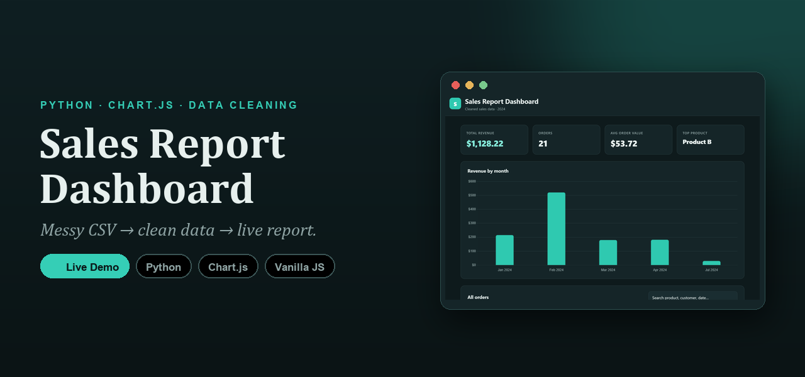

<div align="center">

<a href="https://muhammadhasnain1-debug.github.io/sales-report-dashboard/">
  
</a>

# Sales Report Dashboard

**A messy sales CSV → clean data → a responsive, interactive dashboard.**
A Python cleaning pipeline and a front-end report in one project — no frameworks, no databases.

<br>

[](https://muhammadhasnain1-debug.github.io/sales-report-dashboard/)


</div>

---

## ✨ What it does

Two halves of one workflow:

1. **`clean_data.py`** — a pure-standard-library Python script that turns a realistically messy
   export into analysis-ready data.
2. **The dashboard** — a static, dependency-light front end that reads the cleaned output and
   renders KPIs, a revenue chart, and a searchable/sortable orders table.

---

## 🧹 The cleaning pipeline

`messy_sales.csv` → **`clean_data.py`** → `clean_sales.csv` + `summary.json`

- **Normalises 6 date formats** (`2024-01-05`, `01/15/2024`, `Feb 3, 2024`, …) into one ISO format
- **De-duplicates** repeated rows
- **Tidies text** — collapses whitespace, title-cases names, fills missing customers with `Unknown`
- **Validates numbers** and drops rows it can't parse, then computes `revenue = quantity × unit_price`
- **Builds a summary** — total revenue, order count, revenue-by-month, and top products

<div align="center">

| Messy input | → | Clean dashboard |
|:-:|:-:|:-:|
|  | → |  |

</div>

---

## 📊 The dashboard

- **KPI cards** — total revenue, orders, average order value, top product
- **Revenue-by-month** bar chart (Chart.js, vendored locally — no CDN dependency)
- **Orders table** — live **search** and click-to-**sort** on every column
- **Responsive** and **theme-aware** (light / dark via `prefers-color-scheme`), with a subtle entrance animation

---

## 🛠️ Built with

- **Python** (standard library only — `csv`, `json`, `datetime`) for the cleaning script
- **Vanilla JavaScript** for the dashboard logic (fetch, render, search, sort)
- **Chart.js 4** for the chart (vendored in `vendor/` so the site is self-contained)
- **Plain CSS** — custom properties, grid, responsive, dark mode

---

## 🚀 Run it locally

```bash
git clone https://github.com/MuhammadHasnain1-debug/sales-report-dashboard.git
cd sales-report-dashboard

# 1) regenerate the clean data (optional — outputs are committed)
python clean_data.py

# 2) serve the dashboard (fetch() needs http://, not file://)
python -m http.server 8000
```

Then open `http://localhost:8000`.

---

## 📌 About this project

A portfolio piece showing an end-to-end data workflow — Python data cleaning plus a hand-built
front-end report — using only the standard library and one small charting library.

**More from my portfolio**
- 🕯️ [Ember & Oak](https://muhammadhasnain1-debug.github.io/ember-and-oak/) — a 3D, animated candle-brand landing page
- 🦊 [The Gilded Fox](https://muhammadhasnain1-debug.github.io/the-gilded-fox/) — a dark, cinematic speakeasy landing page
- 📊 [Team Performance Scorecard](https://muhammadhasnain1-debug.github.io/team-performance-scorecard/) — a Google Sheets dashboard

---

<div align="center">

Built by **[Muhammad Hasnain](https://github.com/MuhammadHasnain1-debug)** · MIT License

</div>
